

## 1. Set-up account. Register in a cloud provider. Now you have a root account.

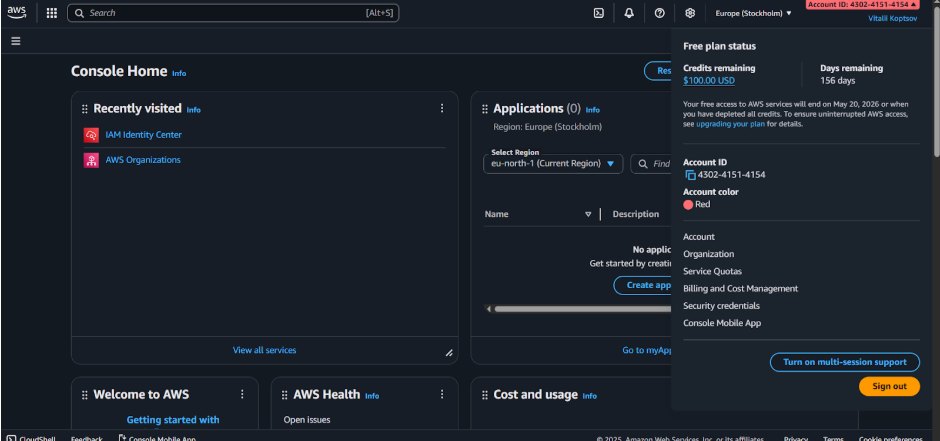

## 2.b Create an IaM Identity center account (or analog for you cloud provider). Also make it full admin.

Я створив IaM Identity center.
Створив користувача, який отримає AdministratorAccess.

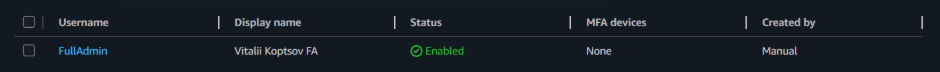

Створив за превизначеним permission set AdministratorAccess.

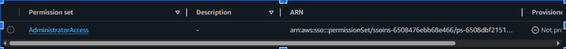

І зв’язав їх в AWS accounts.

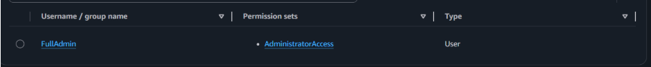

## 3. (Optional) Create an Organisation docs.aws.amazon.com/organizations/latest/userguide/orgs_tutorials_basic.html and user for it. All next labs are to be performed within it.

Організація була створена автоматично, коли я створював IaM Identity center.

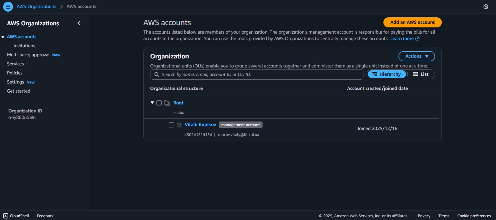

## 4.Create one more user. Create an IaM policy that allows ONLY to view resources (no write access).

Створив користувача.

Створив за превизначеним permission set ReadOnlyAccess.

І зв’язав їх.

## 5. Create a Role that has this policy attached and can be assumed by user from p3.

Permission sets в IaM Identity center виконує функцію ролі. Для демонстрації ціього я створив інший, більш обмежений permission set ViewOnlyAccess. І додав його до OnlyView користувача.

Тепер якщо я зайду на OnlyView мені відобразиться AWS access portal, який дозволить обрати permission set за яким я буду працювати. Цей же інтерфейс дозволяє його змінювати.

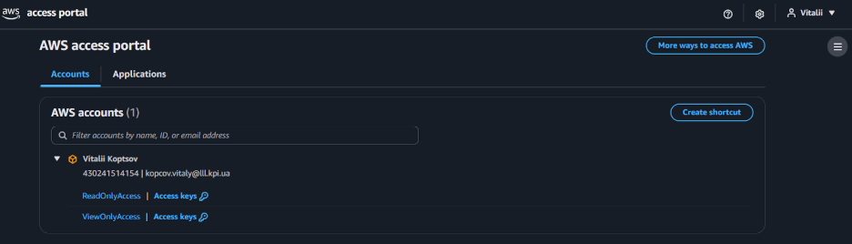

Також я створив окремого IaM користувача OnlyReader

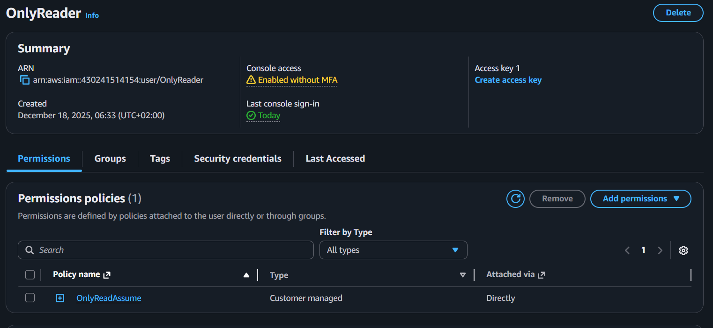

Policy для тільки читання OnlyReader

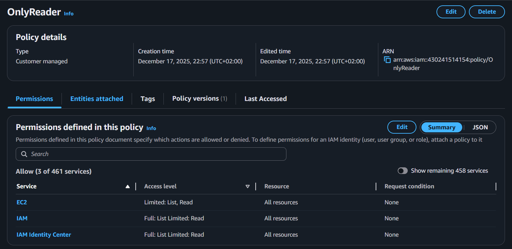

Policy для assume, яка доступна тільки OnlyReader прив'язану до AWS Account.

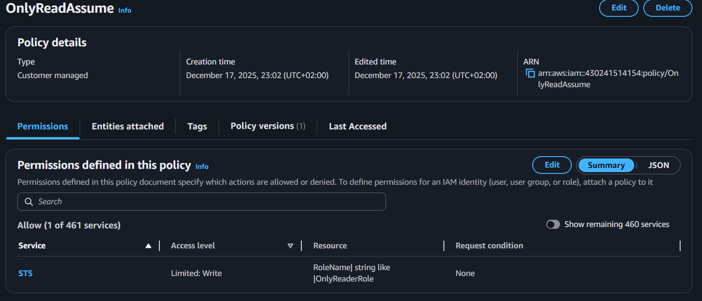

## 6. Create a Cloudformation (or Terraform, OpenTofu, whatever) template describing your policy and role.

У IaC generator створив template, додав в нього ролі і policies.
Згенерований результат у файлі [IaC_generated_role_template.yaml](IaC_generated_role_template.yaml).

## 7. Create a network (VPC for your resources). There should be private and public subnets. Public one has IGW, private ones are for internal access only.

Створив VPC.

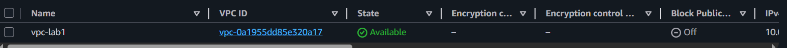

Створив публічну і приватну підмережі.

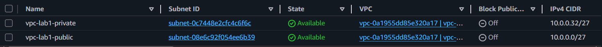

Створив Internet gateway.

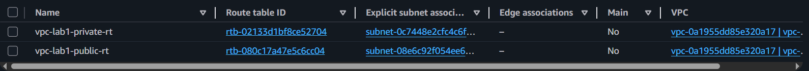

І створив два route table. Один для приватної підмережі. Один для публічної. Прив’язав їх до відповідних підмереж і додав для публічного route table створений Internet gateway.

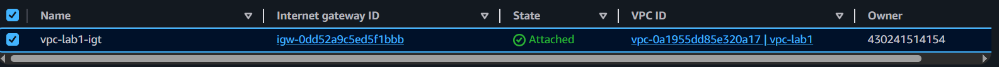

## 8. Create IaC stack holding our network resources.

У IaC generator створив template, додав в нього vpc, subnets, internet gateway і route tables.
Згенерований результат у файлі [IaC_generated_vpc_template.yaml](IaC_generated_vpc_template.yaml).

## 9. Calculate monthly budget for lab 2, assuming there will be only 2 shards.

Для лаб 2 треба нода координатор і 2 шарди зі сховищем.
Я вирішив розрахувати вартість за допомогою AWS pricing calculator.
Я ввів такі потреби.
3 On-Demand EC2 t3.micro з 10 Гб gp3 сховища кожне. І 20 Гб в місяць вихідного трафіку в інтернет.

3 instances x 0.0108 USD On Demand hourly cost x 730 hours in a month = 23.652000 USD

10 GB x 3.00 instance months x 0.0836 USD = 2.51 USD (EBS Storage Cost)

Internet: 20 GB x 0.09 USD per GB = 1.80 USD

Тоді виходить:

Щомісячні витрати: 27.96 USD

Витрати за 12 місяців: 335.52 USD